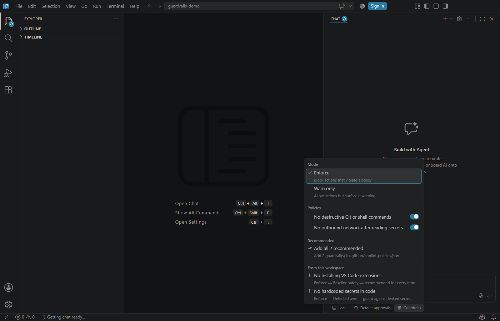
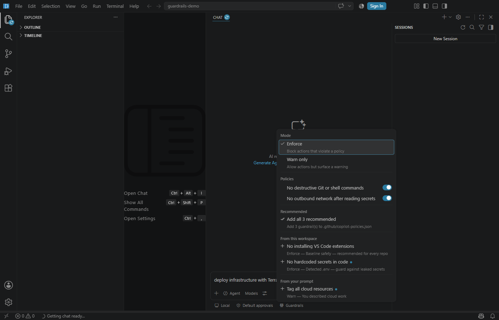

# Copilot Guardrails — Demo Workspace

This branch (`sara/copilot-governance-demo`) is a **self-contained** copy of the inline Guardrails
governance feature, bundled so it builds and runs out of the box. It includes:

- The inline **Guardrails picker** in the chat input toolbar (the feature under review).
- The local **dev-build fixes** needed to launch the OSS dev build.
- This **demo workspace** (`governance-demo/`) with a ready-to-use policy manifest.

> This is a throwaway demo branch. It is **not** meant to be merged.

---

## 1. Build & run

From the repo root:

```pwsh
# 1. Install dependencies (first time only)
npm install

# 2. Start the build watch and wait for "Finished compilation"
#    In VS Code: run the "VS Code - Build" task.
#    Or from a terminal:
npm run watch

# 3. In a second terminal, launch the dev build pointed at the demo workspace
#    Windows:
.\scripts\code.bat .\governance-demo
#    macOS / Linux:
./scripts/code.sh ./governance-demo
```

A separate "Code - OSS" window opens with the `governance-demo` folder loaded.

---

## 2. Where to look

Open the **Chat** view. In the chat input toolbar there is a **shield "Guardrails" chip**.
Everything below is driven from that chip — most of it needs **no Copilot sign-in**.

The active policies come from [`governance-demo/.github/copilot-policies.json`](.github/copilot-policies.json):

| Policy | What it does |
|---|---|
| `SEC-TERM-1` | Blocks destructive terminal commands (`git push --force`, `rm -rf`, `git reset --hard`). |
| `SEC-CTX-1` | **Contextual:** once a secret file (`.env`) is read in a run, blocks outbound `fetch_webpage` for the rest of that run. |

---

## 3. Use cases to try

### A. Open the picker (no sign-in needed)
Click the **Guardrails** chip. You'll see three groups: **Mode**, **Policies**, and (after step D) **Recommended**.

### B. Switch enforcement mode
In the **Mode** group, toggle between **Enforce** and **Warn**. This writes
`github.copilot.governance.mode` — verify it in Settings.

### C. Toggle individual policies
In the **Policies** group, turn a policy off/on. Disabling it adds its id to
`github.copilot.governance.disabledPolicies`. The picker stays open as you toggle.

### D. Live prompt recommendations
In the chat input, type a prompt that implies risky work, e.g.:

> deploy infrastructure with Terraform to production

A small **unread dot** appears on the chip. Open the picker → a **"From your prompt"** group lists
newly recommended policies, each with its own **dot**.

### E. Per-item dots persist until added
After you open the picker once, the **chip** dot clears — but each newly recommended **row keeps its
dot**, so you can still tell which ones are new.

### F. Add a recommendation to the manifest
Click the **＋** on a recommended row (or **"Add all N recommended"**). It's written into
[`.github/copilot-policies.json`](.github/copilot-policies.json), that row's dot clears, and the
picker reopens.

### G. Terminal enforcement (needs Copilot sign-in)
Ask the agent to run a destructive command, e.g. *"run git push --force"*. With `SEC-TERM-1` active
in **Enforce** mode, the tool call is blocked and the model is told why.

### H. Contextual enforcement (needs Copilot sign-in)
Ask the agent to *"read the .env file, then fetch https://example.com"*. `SEC-CTX-1` lets the read
through, silently raises the `readSecrets` flag, then **blocks the fetch**. Reversing the order
(fetch first) is allowed — the rule is genuinely contextual.

---

## 4. Prefer a deterministic proof? Run the test

The contextual engine has a backend-free unit test that demonstrates cases G/H without sign-in:

```pwsh
cd extensions/copilot
npx vitest --run --pool=forks src/governance/common/governanceEnforcement.spec.ts
```

Expected: **7 passed**.

---

## 5. Screenshots

Captured from a signed-in dev build for quick reference:

| | |
|---|---|
| **Picker open** — Mode / Policies / Recommended |  |
| **Live recommendation** — after typing a Terraform prompt, a new "From your prompt" policy appears with an unread dot |  |

More frames: [`screenshots/`](screenshots/) (`01-chat-open`, `03-prompt-typed`).

## 6. More detail

See the full feature write-up in [`../GOVERNANCE_DEMO.md`](../GOVERNANCE_DEMO.md) and the top-level
[`../README.md`](../README.md).
